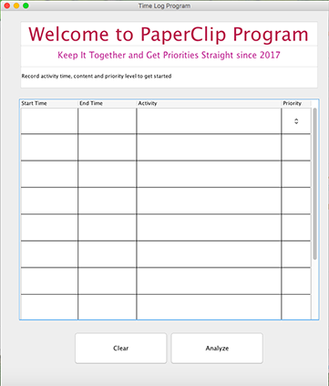
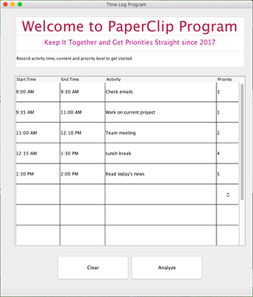
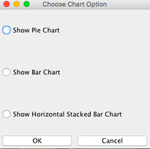
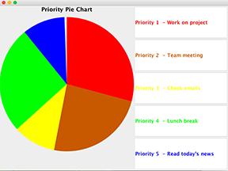
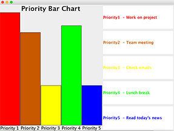
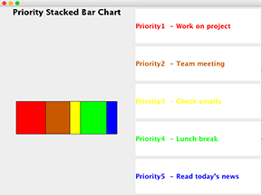

# Time Log Program

This program helps users keep track of their weekly time budget and get priorities straight in their daily lives. It allows users to record the content, document the duration and assign a priority to each activity.

  

When user clicks "Analyze" button, the given data is collected and calculated.

User is then asked to choose a way to display the data: pie chart, bar chart and horizontal stacked bar chart.

  

 

## Activity object stores each activity
After users enter data, each activity, along with its duration and priority, is stored as an Activity object. The [Activity](https://github.com/vantrinh7/TimeLogProgram/blob/master/src/Activity.java) class defines a Activity object that will be added to priority queue. It extends Comparable<> class, thus can be compared, and has three parameters: activity duration, content and priority level. There are methods to get these data, and a compareTo method that defines the relationship between Activity objects in a priority queue.

## Constructing priority queues

+ [Heap](https://github.com/vantrinh7/TimeLogProgram/blob/master/src/Heap.java) is an interface that specifies the necessary methods of a heap. This is a contract for any class that implements it (in this case BinaryHeap) to also implement methods specified inside it. 
+ [BinaryHeap](https://github.com/vantrinh7/TimeLogProgram/blob/master/src/BinaryHeap.java) implements Heap and creates a tree out of an array of values, so that each node in tree has at most 2 children. It is a 'max' heap, meaning that it is arranged in a descending order: Value of each node is larger than both of its children, and the largest value of the array is at the root node.
+ [BinaryHeapBasicTests](https://github.com/vantrinh7/TimeLogProgram/blob/master/src/BinaryHeapBasicTest.java) implements JUnit tests to check the accuracy of methods in BinaryHeap.
+ [PriorityQueue](https://github.com/vantrinh7/TimeLogProgram/blob/master/src/PriorityQueue.java) is an interface that specifies the necessary methods of a priority queue.
+ [PriorityQueueBH](https://github.com/vantrinh7/TimeLogProgram/blob/master/src/PriorityQueueBH.java) implements PriorityQueue. It is basically a binary heap, with extra methods, such as: peek at the maximum value, extract maximum, insert a value and increase value. It also has other methods that will help with the program, such as: get element, get second largest element (after the maximum), check size, check capacity and get string representation of the priority queue.
+ [PriorityQueueBHTest](https://github.com/vantrinh7/TimeLogProgram/blob/master/src/PriorityQueueBHTest.java) uses JUnit tests to check the methods in PriorityQueueBH.

## Creating GUI view and handling mouse click events

+ [TimeLogPanel](https://github.com/vantrinh7/TimeLogProgram/blob/master/src/TimeLogPanel.java) has the primary methods that coordinate all activities of the program, including the views and actions of each component.
+ [TimeCellEditor](https://github.com/vantrinh7/TimeLogProgram/blob/master/src/TimeCellEditor.java) is called by TimeLogPanel, which checks if user enters the time in correct format.
+ [TimeLogApplication](https://github.com/vantrinh7/TimeLogProgram/blob/master/src/TimeLogApplication.java) creates a frame (JFrame) that holds the panel TimeLogPanel. It provides the main method to run the program.

## Analyzing and dislaying different chart types

+ [PieApp](https://github.com/vantrinh7/TimeLogProgram/blob/master/src/PieApp.java) extracts data from priority queue, creates a frame, as well as display the pie chart and labels.
+ [PieChart](https://github.com/vantrinh7/TimeLogProgram/blob/master/src/PieChart.java) is a panel draws the pie shapes.
+ [ChartApp](https://github.com/vantrinh7/TimeLogProgram/blob/master/src/ChartApp.java) extracts data from priority queue, and display the bar chart and labels.
+ [ChartPanel](https://github.com/vantrinh7/TimeLogProgram/blob/master/src/ChartPanel.java) is a panel that draws the shapes of the bars.
+ [BarApp](https://github.com/vantrinh7/TimeLogProgram/blob/master/src/BarApp.java) extracts data from priority queue, and display a horizontal stacked bar chart.
+ [BarPanel](https://github.com/vantrinh7/TimeLogProgram/blob/master/src/BarPanel.java) is a panel that draws that stacked bars in the chart.
